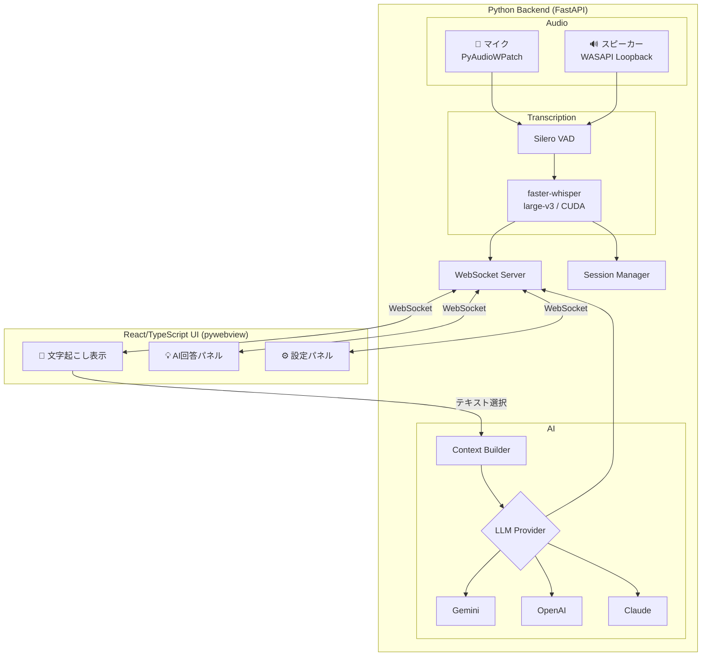
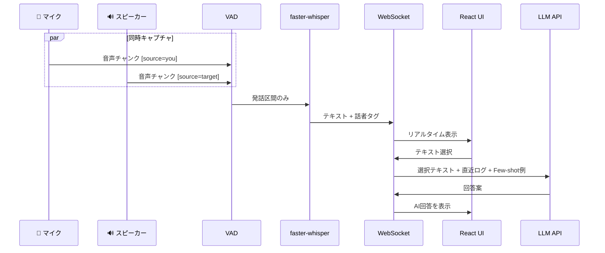

# Alter MVP — 設計書

## 概要

Windows上のシステム音声をリアルタイム文字起こし + AI回答生成するデスクトップオーバーレイアプリ。

**確定事項:**
- アーキテクチャ: Python Backend (FastAPI + WebSocket) + React/TypeScript UI (pywebviewでネイティブウィンドウ化)
- GPU: RTX 5090 → faster-whisper `large-v3` (CUDA)
- LLM: Gemini / OpenAI / Claude 切替可能（Strategyパターン）
- 利用シーン: 仕事中のWeb会議
- 言語: 日本語のみ（初期版）

---

## アーキテクチャ概要



---

## WebSocket メッセージ設計

### Backend → Frontend

```typescript
// 文字起こし結果
{ type: "transcript", speaker: "you" | "target", text: string, timestamp: number }

// AI回答
{ type: "ai_response", answer: string, provider: string }

// デバイス一覧
{ type: "devices", microphones: Device[], speakers: Device[] }

// セッション情報
{ type: "session_info", id: string, name: string, created_at: string }

// ステータス更新
{ type: "status", recording: boolean, model_loaded: boolean }
```

### Frontend → Backend

```typescript
// AI回答リクエスト
{ type: "ai_request", selected_text: string, context_lines: number }

// デバイス選択
{ type: "select_devices", mic_id: number, speaker_id: number }

// セッション操作
{ type: "session_action", action: "new" | "switch" | "rename", session_id?: string, name?: string }

// 設定変更
{ type: "settings", llm_provider: "gemini" | "openai" | "claude" }

// 録音制御
{ type: "recording", action: "start" | "stop" }
```

---

## マルチLLM プロバイダー設計

Strategyパターンで切り替え:

```python
class LLMProvider(ABC):
    @abstractmethod
    async def generate(self, system_prompt: str, user_prompt: str) -> str: ...

class GeminiProvider(LLMProvider): ...   # gemini-2.0-flash
class OpenAIProvider(LLMProvider): ...   # gpt-4o-mini
class ClaudeProvider(LLMProvider): ...   # claude-3-5-haiku
```

APIキー: 環境変数 `GEMINI_API_KEY` / `OPENAI_API_KEY` / `ANTHROPIC_API_KEY`

| プロバイダー | モデル | 選定理由 |
|---|---|---|
| Gemini | `gemini-2.0-flash` | 最速・低コスト |
| OpenAI | `gpt-4o-mini` | 高速・低コスト |
| Claude | `claude-3-5-haiku` | 高速・低コスト |

---

## 話者分離

複雑なダイアライゼーション不要 — 音声ソースで判定:
- **マイク入力** → `[You]`（自分）
- **ループバック入力** → `[Target]`（相手）

---

## セッション管理

```
data/sessions/
├── 2026-02-20_meeting_1/
│   ├── transcript.jsonl    # 文字起こしログ
│   ├── ai_responses.jsonl  # AI回答履歴
│   └── metadata.json       # 会議メタ情報
└── ...

data/user_profile/
└── utterances.jsonl         # 全セッション共通の発話蓄積
```

- 新規会議 → 新ディレクトリ自動生成
- アプリ再起動 → 前回セッションを自動復元
- 学習ループ → `user_profile/` に全セッション横断で蓄積

---

## UIイメージ

```
┌─────────────────────────────────────────┐
│ ⚙️  Alter  │ Session: 2/20 定例 │ ─ ✕  │  ← カスタムタイトルバー
├─────────────────────────────────────────┤
│                                         │
│  [Target] こんにちは、先日の件ですが... │
│                                         │
│          はい、確認しました [You]        │
│                                         │
│  [Target] 予算について教えて            │
│           いただけますか？              │
│                                         │
├─────────────────────────────────────────┤
│ 💡 AI回答 (Gemini ▾):                  │
│  「先日お送りした見積もりベースで        │
│    ¥500万を想定しています」             │
│                              [📋 Copy]  │
└─────────────────────────────────────────┘
```

---

## データフロー



---

## スレッド構成

| スレッド | 役割 |
|---------|------|
| メインスレッド (asyncio) | FastAPI / WebSocket / イベントループ |
| マイクキャプチャスレッド | マイク音声の連続録音 |
| スピーカーキャプチャスレッド | ループバック音声の連続録音 |
| 文字起こし (ThreadPoolExecutor) | faster-whisper推論 |
| AI応答 (async) | LLM APIコール |
